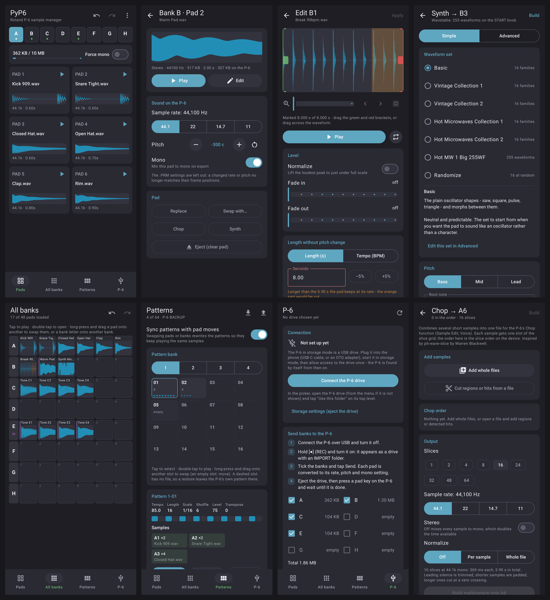

# PyP6 for Android

The PyP6 files manager for the Roland AIRA P-6, on an Android phone. It is
a native app (Kotlin, Jetpack Compose, Material 3) built from the same logic
as the desktop app, and it talks to the P-6 the same way: over USB, with the
P-6 in storage mode showing up as a drive.

Made for phones (tested layouts: 411 x 914 dp, e.g. a Pixel Pro, and a small
360 x 740 dp phone with large text). Android 11 or newer.



## Installing (outside the Play Store)

### With automatic updates: Obtainium

[Obtainium](https://github.com/ImranR98/Obtainium) installs apps straight
from their GitHub releases and updates them when a new release comes out.

1. Install Obtainium (from its
   [releases](https://github.com/ImranR98/Obtainium/releases), F-Droid or
   IzzyOnDroid).
2. In Obtainium, tap **Add App** and paste
   `https://github.com/HomoHabilis/Roland-P6-files-manager`, then **Add**.
   It finds the APK among the release downloads by itself.
3. Tap **Install**. Android asks once to allow installs from Obtainium.

New releases then show up in Obtainium as updates. To also get test
versions (tags like `v5.3.0-rc1`), turn on **Include prereleases** in the
app's settings in Obtainium.

### By hand

1. Get the APK:
   - from a release on the
     [Releases page](https://github.com/HomoHabilis/Roland-P6-files-manager/releases)
     (`PyP6-vX.Y.Z-android.apk`), or
   - from the latest **Android** workflow run on the Actions tab (artifact
     `android`, a zip holding the APK).
2. Open the APK on the phone (Files app or the browser's downloads).
3. Android asks to allow installing apps from that source (Chrome, Files …):
   allow it, go back and tap **Install**. Play Protect may warn about an
   unknown developer - choose **Install anyway**.

Every build is signed with the same key (`app/sideload.jks`, checked in on
purpose), so a newer APK installs over an older one and keeps your samples,
presets and settings. It is a sideloading key for a personal install, not a
store identity.

**Upgrading from a build before the package rename** (app ID
`io.github.pyp6.android`, now `io.github.homohabilis.p6filesmanager`): the new
APK installs as a separate app next to the old one and starts empty. To carry
your work over, save presets to a shared folder in the old app (Presets →
choose a folder) and export your own waveforms as `.p6wf` packs (Settings),
load both in the new app, then uninstall the old one. The P-6 drive has to be
granted once more in the new app.

## Connecting the P-6

The phone needs USB-C to the P-6's USB port (a USB-C to USB-C cable, or the
P-6's usual cable through a USB-C OTG adapter). The P-6 is powered over USB.

1. Start the P-6 in the storage mode the task needs (the app shows the steps
   on each screen):
   - **Send samples:** hold **[●] REC** while switching it on → `IMPORT`
   - **Import a bank:** hold the bank button (**+ SAMPLING** for E-H) → `EXPORT`
   - **Back up patterns:** hold **[▶] PLAY** → `BACKUP`
   - **Restore patterns:** hold **[●] REC** → `RESTORE`
2. The first time, open the **P-6** tab and tap **Connect the P-6 drive**.
   The system picker opens on the USB drive; tap **Use this folder** on its
   top level and allow access. From then on the app finds the P-6 by itself
   whenever it is plugged in (the P-6 tab shows a dot).
3. After writing to the P-6, **eject** before unplugging: pull down the
   notification shade and tap **Eject** on the USB drive notification (or
   Settings › Storage). Then continue on the P-6 (press a pad key after a
   sample upload, [KYBD] after a pattern restore).

## What is there

Everything the desktop app does, arranged as screens instead of one window:

| Screen | Desktop feature |
|---|---|
| **Pads** | Single-bank view: 8 banks, 6 pads each, Force Mono per bank, storage bar, length warnings; Copy/Move bank, Clear banks, Undo/Redo (25 steps) |
| **Pad** (tap a pad) | Load (WAV, MP3, FLAC, M4A, OGG … - decoded by Android, no ffmpeg needed), play as exported, sample rate / pitch / mono, `.PRM` status, swap with any pad, eject (optionally deleting it from the P-6) |
| **Edit** | Waveform editor: trim with brackets (zero-crossing snap), zoom, normalize, fades, length/BPM change without pitch shift (move pieces / stretch spectrum / auto), Fit, keep length while pitching, ½×/2× tempo swap |
| **Chop** | Multisample builder: whole files or regions, Detect Hits with sensitivity, add all/one piece, merge pieces, reorder, 1-64 slices, rate, stereo/mono, normalize modes |
| **Synth** | Wavetable synth: Simple sets (Basic, Vintage 1/2, Hot Microwaves 1/2, Hot MW 1 Big 255WF, Randomize), Advanced step order of up to 16 families, register/root note/upward range, morph preview, table preview, init patch + poly, drawing your own waveforms, single-cycle import (Chain / Pairs / Multi, whole wavetable files split into frames) |
| **All banks** | 8 × 6 overview; long-press and drag a pad onto another (across banks) or a bank letter onto another bank to swap; tap to play |
| **Patterns** | 64 patterns (4 banks of 16): which pads each plays and the other way round, play with the current pads (looped, with step cursor), drag to swap/move, Clear, Sync patterns with pad moves, load from BACKUP or a folder, save to RESTORE or a folder |
| **P-6** | Connection, Banks → P-6 (with .PRM, per-bank sizes and limit), P-6 → Bank, Wipe IMPORT |
| **Presets** | Save/load banks and pattern banks, partial overwrite, load one bank into another; same folder layout and `preset.json` as desktop, so presets move between phone and computer (choose a shared folder) |
| **Settings** | The eleven desktop themes plus Material You, storage warning, removing unused files, `.p6wf` waveform packs import/export, About (project page, original project, license) |

Not carried over: drag & drop of files from a file manager (use Load, which
takes several files at once), and the desktop's window/UI-scale options
(Android's own font and display size settings apply instead).

## Building

```
cd android
./gradlew :core:test            # the Kotlin core, tested against the desktop app
./gradlew :app:assembleRelease  # app/build/outputs/apk/release/app-release.apk
./gradlew :app:testDebugUnitTest  # screenshot tests -> app/build/screenshots
```

Needs JDK 17+ and the Android SDK (platform 37); see [BUILDING.md](BUILDING.md)
for a step-by-step setup and the known pitfalls. The **Android** GitHub
workflow does all of this on every push that touches `android/`.

- `core/` is plain Kotlin (no Android): WAV I/O, resampling, editing, time
  stretch, tempo/hit detection, Chop, `.PRM`, patterns and their preview,
  the wavetable synth, presets and the P-6 drive layout. It builds without
  the Android SDK: `./gradlew -Ppyp6.coreOnly=true :core:test`.
- `core/src/test/.../GoldenTest.kt` compares it with the desktop app's own
  functions; `tools/make_golden.py` regenerates the reference data and
  `tools/extract_resources.py` unpacks the wavetable collections and the
  blank pattern embedded in the desktop script.
- `app/` is the Compose UI. The P-6 drive and preset folders are reached
  through the Storage Access Framework (no storage permission needed).

## License and thanks

Same terms as the rest of the repository: see [LICENSE](../LICENSE) and
[THIRD_PARTY_NOTICES.md](../THIRD_PARTY_NOTICES.md) for the libraries the
APK contains. Thanks to the original
[PyP6](https://github.com/j0kerpack/Roland-P6-sample-manager) project, which
this app is built on.
